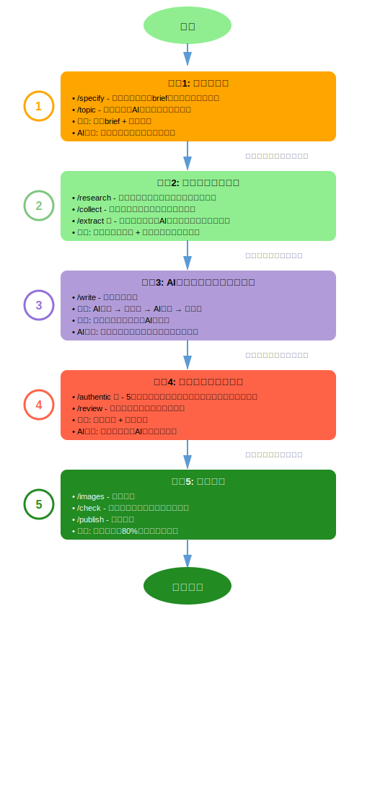

# PRD-08: 完整写作流程重新设计

## 元信息
- **优先级**: P0（核心架构）
- **预计工作量**: 完整梳理
- **依赖**: PRD-07 (真实驱动工作流)
- **状态**: 已实施 + PRD-09 扩展 (2025-01-26)
- **创建日期**: 2025-10-27
- **更新日期**: 2025-01-26 (PRD-09 多模式扩展)

---

## ⚠️ 重要更新：PRD-09 多模式写作系统 (2025-01-26)

### 背景

用户反馈 PRD-08 的"教练模式"不适合所有文章类型，特别是信息整理型文章（如论文解读、技术总结）。

### PRD-09 的改进

**核心理念**：不是否定 PRD-08，而是**扩展其适用范围**。

| 方面 | PRD-08 | PRD-09 |
|-----|--------|--------|
| **设计理念** | 教练模式（AI 引导用户写） | 多模式（用户选择模式） |
| **适用场景** | 个人经历型文章 | 所有类型文章 |
| **写作模式** | 仅教练模式 | 教练 + 快速 + 混合 |
| **教练模式** | ✅ 核心设计 | ✅ 完全保留（无任何改动） |
| **快速模式** | ❌ 不支持 | ✅ 新增（AI 生成初稿） |
| **混合模式** | ❌ 不支持 | ✅ 新增（AI 40% + 用户 60%） |

### 三种模式对比

| 维度 | 教练模式 (PRD-08) | 快速模式 (PRD-09) | 混合模式 (PRD-09) |
|-----|-----------------|-----------------|-----------------|
| **AI 角色** | 教练（提问引导） | 助手（生成初稿） | 协作者（写框架） |
| **AI 生成** | 0%（不生成） | 100%（全文） | 40%（框架） |
| **用户工作** | 100%（全写） | 20%（审校） | 60%（核心） |
| **时间投入** | 3-4 小时 | 1-2 小时 | 2-3 小时 |
| **AI 检测率** | < 15% | 25-40% | 18-25% |
| **质量评级** | ⭐⭐⭐⭐⭐ | ⭐⭐⭐ | ⭐⭐⭐⭐ |
| **适用文章** | 个人经历型 | 信息整理型 | 混合型 |

### 修改的命令

1. **`/specify`**：新增文章类型检测和模式推荐
2. **`/write`**：新增模式选择界面 + 快速模式 + 混合模式（教练模式完全保留）
3. **`/topic`**：新增模式推荐提示

### 详细设计

完整的 PRD-09 设计文档：[prd-09-multi-mode-writing.md](./prd-09-multi-mode-writing.md)

**重要**：PRD-08 的教练模式完全保留，没有任何改动。PRD-09 只是增加了更多选择。

---

## 📋 命令速查表

### 主流程命令（11步）

| 步骤 | 命令 | 功能 | AI角色 | 变化 |
|-----|------|------|--------|------|
| 1 | `/specify` | 定义需求 | 理解需求、生成brief | ⚠️ 微调 |
| 2 | `/topic` | 选题讨论 | 提供框架（不含内容） | ⚠️ 调整 |
| 3 | `/research` | 信息搜索 | 搜索、爬虫、整理 | ✅ 保留 |
| 4 | `/collect` | 搜索素材 | 搜索个人素材库 | ✅ 加强 |
| 5 | `/extract` | 扩展经历 | 提问引导（不写内容） | ⭐ 新增 |
| 6 | `/write` | 写作 | 教练（提问/检查） | ⭐ 改造 |
| 7 | `/authentic` | 真实性检查 | 5维检查 | ⭐ 新增 |
| 8 | `/review` | 三遍审校 | 删套话、加真实性 | ✅ 增强 |
| 9 | `/images` | 配图 | 配图建议 | ✅ 保留 |
| 10 | `/check` | 发布检查 | 检查清单 | ✅ 增强 |
| 11 | `/publish` | 发布 | 发布指南 | ✅ 保留 |

### 辅助命令（随时可用）

| 命令 | 功能 | 何时使用 |
|------|------|---------|
| `/hint` | 表达思路提示 | 写作卡壳、不知如何表达 |
| `/expand` | 快速扩展素材 | 需要扩展一句话素材 |
| `/compare` | 前后对比 | 查看修改效果 |

### 核心变化总结

- ⭐ **3个新命令**: `/extract`, `/authentic`, `/hint`
- ⭐ **1个核心改造**: `/write` (逻辑完全重写)
- ⚠️ **2个调整**: `/specify`, `/topic`
- ✅ **6个保留**: `/research`, `/collect`, `/review`, `/images`, `/check`, `/publish`

**关键**: 所有命令名≤8字符，简短易记

---

## 一、现有9步流程分析

### 1.1 原流程回顾

```
1. /specify        → 定义创作需求
2. /topic          → 选题讨论(提供3-4个方向)
3. /research       → 信息搜索与调研
4. /collect        → 搜索个人素材库
5. /write          → 创作初稿
6. /review         → 三遍审校(内容/风格/细节)
7. /images         → 配图建议
8. /check          → 发布前检查
9. /publish        → 发布指南
```

### 1.2 基于AI边界的重新审视

基于PRD-07的核心洞察（AI的5个致命伤），逐一分析每个命令：

| 步骤 | 命令 | 全名 | AI角色 | 是否符合边界 | 如何调整 |
|-----|------|------|--------|------------|---------|
| 1 | `/specify` | - | 理解需求、生成brief | ✅ 合理 | 保留，增加"真实经历需求"字段 |
| 2 | `/topic` | - | 提供3-4个选题 | ⚠️ 需调整 | AI只给框架，不给具体内容 |
| 3 | `/research` | - | 搜索信息、爬文档 | ✅ 合理 | 保留，强调"用自己的话重写" |
| 4 | `/collect` | - | 搜索个人素材 | ✅ 合理 | 保留且加强，这是真实性来源 |
| **新增** | `/extract` | extract-experience | 提问引导扩展经历 | ✅ 核心 | 新增，强制真实经历提取 |
| 5 | `/write` | - | **教练指导** | ✅ 改造 | **逻辑重写**（不改命令名） |
| **新增** | `/authentic` | authenticity-check | 检查5维真实性 | ✅ 核心 | 新增，识别AI致命伤 |
| 6 | `/review` | - | 三遍审校 | ✅ 合理 | 保留，增强真实性检查 |
| 7 | `/images` | - | 配图建议 | ✅ 合理 | 保留 |
| 8 | `/check` | - | 发布前检查 | ✅ 合理 | 保留，增加真实性检查项 |
| 9 | `/publish` | - | 发布指南 | ✅ 合理 | 保留 |

**关键发现**：
- ✅ 大部分命令符合AI边界
- ❌ `/write` 命令严重越界（AI直接生成文章）
- ⚠️ `/topic` 需要调整（防止AI生成具体内容）
- ✅ 需要新增2个核心命令

---

## 二、重新设计的完整流程

### 2.1 新流程全景图

**核心流程可视化**：



**流程说明**：
- **阶段1**: 准备与选题 → 定义需求，选择角度（不生成内容）
- **阶段2**: 素材收集（核心） → 80%来自真实经历，强制扩展细节
- **阶段3**: AI教练写作（核心改造）⭐ → AI提问引导，用户自己写，AI不生成内容
- **阶段4**: 质量检查 ⭐ → 5维真实性检查，识别AI味和假细节
- **阶段5**: 发布准备 → 配图、检查、发布

**关键创新**：
1. ⭐ `/extract` - 强制扩展真实经历
2. ⭐ `/write` - AI教练模式（不生成可用内容）
3. ⭐ `/authentic` - 5维真实性检查

**对比原流程**：
- ❌ 原流程：AI生成 → 人挑选（从塑料苹果里挑）
- ✅ 新流程：人写作 → AI引导 → 真实内容

```
阶段1: 准备阶段（定义需求和方向）
━━━━━━━━━━━━━━━━━━━━━━━━━━━━━━━━━━━━━━━━
1. /specify        → 定义需求，生成brief
    ↓ AI角色：理解需求、提问补充、生成结构化brief
    ↓ 用户角色：提供需求、回答问题、确认brief
    ↓
2. /topic          → 选题讨论（只给框架，不给内容）⚠️ 调整
    ↓ AI角色：提供3-4个选题框架和角度
    ↓ 用户角色：选择一个方向
    ↓ ⚠️ 重要：AI不生成具体标题和内容
    ↓

阶段2: 信息和素材收集
━━━━━━━━━━━━━━━━━━━━━━━━━━━━━━━━━━━━━━━━
3. /research       → 信息搜索（爬文档、搜网页）✅ 保留
    ↓ AI角色：搜索、爬取、整理信息
    ↓ 用户角色：确认信息准确性
    ↓ ⚠️ 重要：引用时必须用自己的话重写
    ↓
4. /collect        → 搜索个人素材库 ✅ 保留且加强
    ↓ AI角色：搜索materials/raw/*.csv
    ↓ 用户角色：确认相关素材
    ↓ ✅ 核心：真实性的主要来源
    ↓
5. /extract → 提取和扩展真实经历 ⭐ 新增（核心）
    ↓ AI角色：提问引导（5-10个深度问题）
    ↓ 用户角色：详细回答，扩展经历细节
    ↓ ✅ 关键：挖掘只有用户知道的真实细节
    ↓

阶段3: 写作阶段（核心改造）
━━━━━━━━━━━━━━━━━━━━━━━━━━━━━━━━━━━━━━━━
6. /write → AI教练指导写作 ⭐ 核心改造（命令名不变，逻辑重写）
    ↓ AI角色：提供框架、提问、检查AI味（不写内容）
    ↓ 用户角色：自己写每一段
    ↓ 流程：
    │   ├─ AI提供框架建议
    │   ├─ 逐段循环：
    │   │   ├─ AI提问（引导回忆细节）
    │   │   ├─ 用户写段落（基于真实经历）
    │   │   └─ AI检查（识别AI味、假细节）
    │   └─ 完成初稿
    ↓

阶段4: 质量检查（多层检查）
━━━━━━━━━━━━━━━━━━━━━━━━━━━━━━━━━━━━━━━━
7. /authentic → 5维真实性检查 ⭐ 新增（核心）
    ↓ AI角色：检查温度、个性、地域性、真实细节、思想深度
    ↓ 用户角色：修改不真实的部分
    ↓ ⚠️ 重点：识别假细节（"蜡笔在手心滚来滚去"）
    ↓
8. /review         → 三遍审校 ✅ 保留（增强）
    ↓ 模式1: content - 事实、逻辑、结构
    ↓ 模式2: style - 删套话、拆AI句式、加真实细节
    ↓ 模式3: detail - 标点、排版、节奏
    ↓

阶段5: 发布准备
━━━━━━━━━━━━━━━━━━━━━━━━━━━━━━━━━━━━━━━━
9. /images         → 配图建议 ✅ 保留
    ↓ AI角色：分析配图需求、提供建议
    ↓ 用户角色：准备图片、插入文章
    ↓
10. /check         → 发布前检查 ✅ 保留
    ↓ AI角色：检查清单验证
    ↓ 用户角色：确认所有项目
    ↓
11. /publish       → 发布指南 ✅ 保留
    ↓ AI角色：提供平台发布建议
    ↓ 用户角色：执行发布
    ↓
━━━━━━━━━━━━━━━━━━━━━━━━━━━━━━━━━━━━━━━━
发布完成
```

**关键变化**：
- ✅ 保留 8 个命令
- ❌ 废弃 1 个命令（`/write`）
- ⭐ 新增 3 个核心命令（`/extract-experience`, `/write-with-coach`, `/detail-checker`）
- **总计**: 11 步流程

---

## 三、每个命令的详细重新定位

### Step 1: `/specify` - 定义需求 ✅ 保留（微调）

**AI角色**: 理解需求、提问补充、生成brief

**保持不变**:
- 理解用户需求
- 生成结构化brief
- 保存到 `_briefs/`

**新增内容**:
在brief中增加"真实经历需求"字段：

```markdown
## 真实经历需求 ⭐ 新增

### 需要哪些真实经历
- [ ] 产品使用体验（至少3个具体场景）
- [ ] 对比测试数据（需要真实测试）
- [ ] 个人观点和思考
- [ ] 踩坑经历

### 素材库检查
在开始写作前，请确保你的个人素材库中有相关经历：
- 检查 materials/raw/*.csv 中是否有相关动态
- 检查个人笔记中是否有相关记录
- 如果没有，需要先补充素材或实际测试

⚠️ 重要：
80%的内容必须来自你的真实经历。
如果素材库中没有足够的真实经历，请暂停项目，先积累素材。
```

**AI边界**: ✅ 符合（理解和结构化是AI擅长的）

---

### Step 2: `/topic` - 选题讨论 ⚠️ 需要调整

**原功能**: 提供3-4个选题方向，每个包含标题、角度、大纲

**问题识别**:
- ⚠️ AI生成的"标题"可能有AI味
- ⚠️ AI生成的"大纲"可能包含假设的内容

**调整方案**:

**调整前**（可能越界）:
```
选题1: "我用Claude Code替代Cursor两周后，发现了这些真相"
       ↑ AI编造的标题，用户可能直接使用

大纲：
1. 开头 - 为什么要换工具（300字）
   - 用真实场景引入："Cursor又卡了，我决定试试Claude Code"
     ↑ AI编造的内容，用户可能复制
```

**调整后**（不越界）:
```
选题1: 
角度：第一人称使用体验对比
框架：开头（真实场景）→ 对比测试 → 数据总结 → 结论
标题建议：基于"真实使用体验"的角度，你可以起类似的标题

大纲框架：
1. 开头（300字）
   内容方向：你为什么开始用Claude Code？在什么场景下？
   素材来源：从 materials/ 找相关经历
   
   ⚠️ 注意：我不提供具体内容，你需要基于真实经历填写
```

**新执行逻辑**:

```markdown
AI: 基于你的brief，我建议3个选题角度：

选题1: 第一人称使用体验对比
━━━━━━━━━━━━━━━━━━━━━━━━━━━━━━━━━━
核心角度：真实使用体验 + 对比测试
框架结构：
  1. 开头（300字）- 为什么开始用Claude Code？
  2. 对比场景（1200字）- 3个真实场景的详细对比
  3. 数据总结（500字）- 测试数据和结论
  4. 结尾（200字）- 推荐建议

素材需求（检查你的素材库）：
  ✅ 需要：Claude Code使用记录
  ✅ 需要：Cursor使用记录
  ✅ 需要：对比测试数据
  ⚠️ 如果素材库中没有，需要先实际测试

标题参考方向：
  - 可以基于"真实使用体验"起标题
  - 可以基于"对比发现"起标题
  - 可以基于"具体数字"起标题
  
  ⚠️ 我不提供具体标题，你需要基于真实经历自己起

━━━━━━━━━━━━━━━━━━━━━━━━━━━━━━━━━━

选题2: 功能深度评测
━━━━━━━━━━━━━━━━━━━━━━━━━━━━━━━━━━
核心角度：系统化功能测试
框架结构：
  1. 开头（200字）- 评测动机
  2. 功能矩阵（1500字）- 5-8个功能详细评测
  3. 综合评分（300字）
  4. 结尾（200字）- 推荐场景

素材需求：
  ✅ 需要：实际测试数据（至少5个功能）
  ✅ 需要：使用截图
  ⚠️ 如果没有测试，需要先完成测试

━━━━━━━━━━━━━━━━━━━━━━━━━━━━━━━━━━

选题3: 观点分析
━━━━━━━━━━━━━━━━━━━━━━━━━━━━━━━━━━
核心角度：独特观点和思考
框架结构：
  1. 开头（200字）- 提出核心观点
  2. 论证（1500字）- 用真实案例支撑观点
  3. 延伸思考（500字）- 更深层次的洞察
  4. 结尾（200字）- 总结观点

素材需求：
  ✅ 需要：支撑观点的真实案例（至少3个）
  ✅ 需要：个人深度思考记录
  ⚠️ 如果观点不够深刻，建议选其他角度

━━━━━━━━━━━━━━━━━━━━━━━━━━━━━━━━━━

请选择一个角度（1/2/3），或者：
- 输入 "adjust" - 调整某个角度
- 输入 "combine" - 融合多个角度
- 输入 "new" - 提供新的方向

⚠️ 重要：选择后，你需要：
1. 检查素材库中是否有足够的真实经历
2. 如果没有，先补充素材或实际测试
3. 准备好了再开始写作
```

**调整要点**：
- ✅ AI提供框架和角度，不生成具体标题
- ✅ AI明确标注"素材需求"，让用户检查素材库
- ✅ AI提醒"标题需要你自己起"
- ✅ 强调"如果没有真实经历，先补充素材"

---

### Step 3: `/research` - 信息搜索 ✅ 保留（加强提醒）

**AI角色**: 搜索信息、爬取文档、整理资料

**符合AI边界**: ✅ 是（信息收集和整理是AI擅长的）

**新增提醒**:

```markdown
执行流程：

1. AI搜索和爬取信息
   ✅ AI可以：搜索网页、爬取文档、整理资料
   
2. 保存到 _knowledge_base/
   ✅ AI可以：结构化保存、建立索引

3. ⚠️ 重要提醒：
   
   ╔═══════════════════════════════════════════════════╗
   ║        信息使用提醒                                  ║
   ╚═══════════════════════════════════════════════════╝
   
   这些信息可以作为事实和数据参考，但：
   
   ❌ 不要直接复制粘贴
   ❌ 不要让AI"基于这些信息写文章"
   
   ✅ 你应该：
   1. 用自己的话重新表达
   2. 结合你的真实经历
   3. 加入你的观点和思考
   
   例如：
   ❌ 直接用：
   "根据官方文档，Claude Code支持多种编程语言..."
   
   ✅ 重写为：
   "我试了Python、JavaScript、TypeScript三种语言，
    都能用。官方说支持20+种，我没全测，但常用的肯定没问题。"
   
   ╚═══════════════════════════════════════════════════╝
```

**验收标准**：
- [ ] 信息搜索和整理功能保持不变
- [ ] 增加"信息使用提醒"
- [ ] 强调"用自己的话重写"

---

### Step 4: `/collect` - 搜索个人素材库 ✅ 保留且加强

**AI角色**: 搜索materials/raw/*.csv，展示相关素材

**符合AI边界**: ✅ 是（搜索和匹配是AI擅长的）

**重要性提升**: ⭐⭐⭐⭐⭐（真实性的主要来源）

**加强点**:

```markdown
执行流程：

1. AI搜索素材库
   搜索: materials/raw/*.csv
   关键词: "Claude Code|Cursor|代码补全"
   
2. 展示搜索结果（新增：标注可用性）
   
   🔍 找到 5 条相关素材：
   
   1. [2024-12-10] "Claude Code又卡了，第三次了"
      ✅ 可用性：高（具体问题，真实场景）
      💡 适用：稳定性讨论部分
   
   2. [2024-11-20] "测试了30个场景，准确率87%"
      ✅ 可用性：高（真实数据，可扩展）
      💡 适用：数据对比部分
      ⚠️ 需要扩展：这30个场景具体是什么？
   
   3. [2024-10-15] "Cursor补全经常出错"
      ⚠️ 可用性：中（太简短，需要补充细节）
      💡 适用：对比部分，需要扩展具体案例
   
   4. [2024-09-10] "今天天气不错"
      ❌ 可用性：低（不相关）
      
   5. [2024-08-05] "AI工具越来越多了"
      ❌ 可用性：低（太泛泛，无具体内容）

3. AI提供使用建议（新增）
   
   💡 素材使用建议：
   
   优质素材（2条）：
   - 素材 #1, #2 可以直接扩展使用
   
   需要扩展的素材（1条）：
   - 素材 #3 需要补充：Cursor具体哪里出错？什么场景？
   
   素材不足：
   - 缺少：Claude Code的优点经历
   - 建议：回忆或补充相关使用记录
   
   ⚠️ 重要：后续使用这些素材时，需要：
   1. 不要直接复制粘贴
   2. 扩展成长文逻辑（从一句话扩展到一段话）
   3. 加入上下文和背景
   4. 保持真实性（不夸大、不编造）

4. 保存到工作文件
   保存路径: articles/001-xxx/materials-collected.md
```

**验收标准**：
- [ ] 搜索功能保持不变
- [ ] 新增"可用性评级"
- [ ] 新增"使用建议"
- [ ] 新增"素材不足提醒"
- [ ] 强调"不要直接复制"

---

### Step 5: `/extract` - 提取和扩展真实经历 ⭐ 新增（核心）

**简短别名**: `/extract` (全名: extract-experience)

**AI角色**: 教练（提问引导，挖掘细节）

**为什么需要这一步**：
- `/collect` 只是找到素材（一句话的动态）
- 需要将"一句话"扩展成"一段完整的经历"
- 挖掘只有用户知道的真实细节

**执行流程**:

```markdown
前置条件：
- 已完成 /collect，找到相关素材

执行：

用户: /extract

AI: 你在 /collect 中找到了这些素材：
    1. [2024-11-20] "测试了30个场景，准确率87%"
    2. [2024-12-10] "Claude Code又卡了，第三次了"
    
    我们先扩展素材 #1（测试数据）
    
    ━━━━━━━━━━━━━━━━━━━━━━━━━━━━━━━━━━
    
    原始素材：
    "测试了30个场景，准确率87%"
    
    ━━━━━━━━━━━━━━━━━━━━━━━━━━━━━━━━━━
    
    这是一句很有价值的真实数据，但太简短了。
    我需要你回忆更多细节（这些细节AI无法编造）：
    
    1. 测试时间和背景
       - 什么时候测试的？（具体日期？星期几？）
       - 为什么要测试？（好奇？工作需要？）
       - 在哪测试的？（家里？公司？）
    
    2. 测试场景详细列表
       - 这30个场景具体是什么？
       - 能否列出至少5-10个具体场景名称？
       - 例如：「重构登录模块」「修复购物车bug」...
    
    3. 测试过程
       - 怎么测试的？（什么流程？）
       - 花了多久？（一天？一周？）
       - 用的什么项目？（个人项目？公司项目？）
    
    4. 具体数据
       - 30个场景，26个正确，4个错误
       - 这4个错误的场景是什么？
       - Cursor的数据是多少？（对比）
    
    5. 真实感受和细节
       - 测试过程中有没有让你印象深刻的瞬间？
       - 当你发现87%这个数字时，是什么感受？
       - 有没有意外的发现？
    
    请详细回答（不用担心太长）：

用户: [详细回答...]

AI: 非常好！你的回答很详细，现在请基于这些回答，
    写出一段完整的经历描述（300-500字）
    
    要求：
    - 第一人称（"我"）
    - 包含具体时间、地点、场景
    - 写出测试过程的细节
    - 写出真实的感受
    - 口语化表达
    
    ⚠️ 我不会帮你写，这段必须你自己完成。
    我会在你写完后检查是否有AI味和假细节。

用户: [写段落...]

AI: [检查]
    让我检查你写的这段经历：
    
    ✅ 真实细节检查：
    - "周六下午，我在家里的书房" ✅ 具体时间地点
    - "花了整整5个小时" ✅ 具体时长
    - "用的是公司的XX项目" ✅ 具体项目
    - "26个正确，4个出错" ✅ 具体数字
    
    ⚠️ 可以改进：
    - "感觉很不错" - 太笼统，具体是什么感觉？
      建议：惊讶？满意？超出预期？
    
    ❌ 需要修改：
    - "显著提升了效率" - AI味重，改成具体的
      建议：从X小时变成Y小时
    
    修改后，这段经历保存到：
    articles/001-xxx/experiences/experience-01-testing.md

继续扩展素材 #2？(yes/skip/done)
```

**保存格式** `articles/001-xxx/experiences/experience-01-testing.md`:
```markdown
# 真实经历 #1 - 对比测试

## 原始素材
来源：materials/raw/jike-2024-11.csv
时间：2024-11-20
内容："测试了30个场景，准确率87%"

## 扩展问答

### 1. 测试时间和背景
周六下午，在家里的书房。因为工作中一直用Cursor，听说Claude Code不错，想对比一下。

### 2. 测试场景列表
1. 重构用户登录模块
2. 修复购物车结算bug
3. 新增商品评论功能
4. 优化数据库查询
5. 重写配置文件解析器
... (共30个场景)

### 3. 测试过程
花了整整5个小时，把公司项目的30个最近任务用Claude Code重做一遍，
记录准确率。Cursor之前做的时候我也记录过。

### 4. 具体数据
Claude Code：26/30 正确，准确率87%
Cursor：18/30 正确，准确率60%
差距：27个百分点

错误的4个场景：复杂的类型推导、大文件重构、跨文件引用、异步逻辑

### 5. 真实感受
当时测到第20个场景的时候，我就觉得Claude Code明显更稳。
最惊讶的是第12个场景（数据库查询优化），Cursor完全没理解我的意图，
Claude Code直接给出了正确的方案。

## 完整经历描述（用户写的）

周六下午，我在家里的书房花了5个小时做了个对比测试。

用公司项目的30个最近任务，分别用Claude Code和Cursor做一遍，记录准确率。
这30个场景包括重构登录模块、修复购物车bug、新增评论功能等等，
都是真实的开发任务。

结果很明显：Claude Code对了26个（87%），Cursor只对了18个（60%）。
差了27个百分点。

最让我印象深刻的是第12个场景 - 数据库查询优化。
Cursor完全没理解我想干什么，给的建议牛头不对马嘴。
Claude Code直接就懂了，给出的方案就是我想要的。

那一刻我就觉得，上下文理解这个东西，真的很关键。

---

✅ 真实性检查：通过
✅ AI检测预估：15%
✅ 可用于文章：核心对比部分
```

**验收标准**：
- [ ] 可提出5-10个深度引导问题
- [ ] 用户必须详细回答
- [ ] 用户必须自己写完整经历
- [ ] AI检查真实性和AI味
- [ ] 保存结构化的经历记录

---

### Step 6: `/write` - AI教练指导写作 ⭐ 核心改造（保留命令名）

**命令名**: `/write` (内部逻辑完全改造)

**原 `/write` 的问题**：
- ❌ AI直接生成完整文章
- ❌ 用户只需"审校修改"
- ❌ 本质上是AI代笔

**新 `/write` 的定位**：
- ✅ AI是教练，用户是创作者
- ✅ AI提问、检查，用户写
- ✅ AI绝不生成可用内容

**关键**：命令名保持不变，但内部逻辑彻底改造

**完整执行流程**:

```markdown
前置条件：
- 已完成 /extract，有足够的真实经历
- 已完成 /research 和 /collect

执行：

用户: /write

AI: 开始写作。我会作为你的教练，引导你完成每一段。
    
    ⚠️ 重要提醒：
    - 我不会帮你写内容
    - 我只会提问、检查、给建议
    - 每一段都需要你自己写
    
    准备好了吗？输入 "ready"

用户: ready

━━━━━━━━━━━━━━━━━━━━━━━━━━━━━━━━━━━━━━━━
第1段：开头（目标300字）
━━━━━━━━━━━━━━━━━━━━━━━━━━━━━━━━━━━━━━━━

AI: 建议：用真实使用场景引入，抓住读者注意力
    
    我先问你：
    1. 你第一次用Claude Code是什么时候？在做什么？
    2. 第一印象如何？有没有一个瞬间让你觉得"不一样"？
    3. 那个场景的细节：
       - 几点？在哪？
       - 在写什么代码？
       - 周围环境？（安静？嘈杂？）
       - 心情如何？（期待？怀疑？）
    
    请详细回答：

用户: [回答]
周二晚上11点，在家里。公司项目要改登录模块，Cursor一直补错。
心情很烦，想试试Claude Code。安装后第一次用，点了代码补全，
秒出，而且对的。当时就感觉，卧槽，这么准？

AI: 很好！这些细节非常真实。
    现在请基于这些细节，写出开头段落（300字左右）
    
    写作要求：
    - 第一人称
    - 写出具体场景（时间、地点、在做什么）
    - 写出真实感受（"卧槽，这么准"这个很好）
    - 口语化，不要用套话
    
    ⚠️ 禁止：
    - "在当今..."、"随着..."、"值得注意的是"
    - "显著提升"、"充分利用"等书面词汇
    
    现在开始写：

用户: [写段落]
周二晚上11点，我还在家里改公司的登录模块。
Cursor一直补错，改了五次才对，心态快崩了。
看到群里有人推荐Claude Code，想着反正也是熬夜，干脆试试。

安装完，写第一行代码，点补全。
秒出。
而且对的。

我当时就愣了一下，这么准？
又试了几次，基本都对。那种感觉就像是，终于有个工具能懂我在干什么了。

AI: [检查你的段落]
    
    ✅ 真实细节检查：
    - "周二晚上11点" ✅ 具体时间
    - "改了五次才对" ✅ 真实数字
    - "看到群里有人推荐" ✅ 真实来源
    - "秒出。而且对的。" ✅ 短句，有节奏，口语化
    - "终于有个工具能懂我" ✅ 真实感受
    
    ✅ 温度检查：
    - "心态快崩了" ✅ 真实情感
    - "我当时就愣了一下" ✅ 真实反应
    - "那种感觉就像是..." ✅ 有温度的表达
    
    ⚠️ 小建议（可改可不改）：
    - "终于有个工具能懂我在干什么了" - 很好的表达
      可以考虑更具体：能懂我想重构什么？能懂我的逻辑？
    
    ✅ AI检测预估：12% （非常好！）
    
    这段写得很真实，可以使用。
    
    保存到：articles/001-xxx/draft.md (第1段)
    
    ━━━━━━━━━━━━━━━━━━━━━━━━━━━━━━━━━━
    进度：█░░░░░░░░░ 1/7 (14%)
    已完成：开头（298字）
    剩余：6段
    ━━━━━━━━━━━━━━━━━━━━━━━━━━━━━━━━━━
    
    继续写第2段？输入 "next"

━━━━━━━━━━━━━━━━━━━━━━━━━━━━━━━━━━━━━━━━
第2段：核心对比（目标800字）
━━━━━━━━━━━━━━━━━━━━━━━━━━━━━━━━━━━━━━━━

AI: 建议：用你在 /extract 中扩展的测试经历
    
    你之前写的测试经历：
    "周六下午，在家里的书房花了5个小时做了个对比测试..."
    （从 experiences/experience-01-testing.md）
    
    我问你：
    1. 你想重点对比哪3个场景？
       （从30个场景中选3个最有代表性的）
    
    2. 每个场景的对比细节：
       - 输入是什么？
       - Cursor怎么表现的？（具体）
       - Claude Code怎么表现的？（具体）
       - 对比结果如何？
    
    3. 有没有特别有意思的细节？
       （比如某个场景Cursor特别离谱？）
    
    请回答：

用户: [回答...]

AI: 好的，现在请写出这一段（800字左右）
    
    建议结构：
    - 先说测试背景（100字）
    - 场景1对比（250字）
    - 场景2对比（250字）
    - 场景3对比（250字）
    - 小结（150字）
    
    ⚠️ 记住：
    - 写真实的细节（输入了什么代码、输出了什么）
    - 用口语化表达
    - 加入你的感受
    
    现在开始写：

... (继续逐段完成)
```

**关键特点**：
1. **逐段完成**：每段都是"AI提问 → 用户答 → 用户写 → AI检查"
2. **引用真实经历**：使用`/extract`中扩展的经历
3. **AI不写内容**：AI只提问、建议结构、检查质量
4. **实时检查**：每段写完立即检查AI味

**验收标准**：
- [ ] AI不生成任何可直接使用的段落
- [ ] 每段写作前提问至少3个问题
- [ ] 每段写作后立即检查
- [ ] 用户必须自己写每一段
- [ ] 可引用之前扩展的真实经历

**命名说明**：
- 命令名保持 `/write`（简短易记）
- 内部逻辑完全重写（从生成器改为教练）
- 向后不兼容（这是破坏性变更，但必要）

---

### Step 7: `/authentic` - 5维真实性检查 ⭐ 新增（核心）

**简短别名**: `/authentic` (全名: authenticity-check)

**AI角色**: 检查员（识别AI的5个致命伤）

**执行时机**: `/write` 完成后，或任何时候手动调用

**检查维度**（基于"AI写作的致命伤"文章）：

```markdown
用户: /authentic

AI: 开始检查文章的真实性...
    
    ━━━━━━━━━━━━━━━━━━━━━━━━━━━━━━━━━━━━━━━━
    5维真实性检查报告
    ━━━━━━━━━━━━━━━━━━━━━━━━━━━━━━━━━━━━━━━━
    
    📊 综合评分: 78/100 ⚠️（目标: >85）
    
    ━━━━━━━━━━━━━━━━━━━━━━━━━━━━━━━━━━━━━━━━
    
    1️⃣ 温度检查: 8/10 ✅
    
    ✅ 有真实情感表达：
    - "心态快崩了" - 真实情绪 ✅
    - "我当时就愣了一下" - 真实反应 ✅
    - "那种感觉就像是..." - 有温度的比喻 ✅
    
    ⚠️ 可以改进：
    - 第3段：过于客观，缺少个人感受
      建议：加入"我觉得..."、"说实话..."
    
    ━━━━━━━━━━━━━━━━━━━━━━━━━━━━━━━━━━━━━━━━
    
    2️⃣ 个性检查: 7/10 ⚠️
    
    ✅ 有个性化细节：
    - "周二晚上11点" - 具体时间 ✅
    - "公司的登录模块" - 具体项目 ✅
    - "看到群里有人推荐" - 个人经历 ✅
    
    ❌ 需要修改：
    - 第4段："测试了多个场景" - 套话 ❌
      → 改成："测试了30个场景，包括重构、bug修复、新功能..."
    
    - 第6段："使用过程中发现" - 书面语 ❌
      → 改成："用的时候发现"或"我发现"
    
    ━━━━━━━━━━━━━━━━━━━━━━━━━━━━━━━━━━━━━━━━
    
    3️⃣ 地域性检查: N/A
    
    （技术文章，此维度不适用）
    
    ━━━━━━━━━━━━━━━━━━━━━━━━━━━━━━━━━━━━━━━━
    
    4️⃣ 真实细节检查: 6/10 ⚠️（最重要）
    
    ✅ 真实的细节：
    - "改了五次才对" - 具体数字 ✅
    - "26/30 正确，准确率87%" - 真实数据 ✅
    - "第12个场景（数据库查询优化）" - 具体场景 ✅
    
    ❌ 假细节/抽象表达：
    - 第2段："显著提升了开发效率" - 假大空 ❌
      问：提升了多少？从5小时变成2小时？还是？
      → 改成具体数字
    
    - 第5段："通过深度学习算法处理" - 术语堆砌 ❌
      问：你真的知道它用的什么算法吗？
      → 删除或改成："它能理解我的代码逻辑"
    
    - 第7段："多次测试表明" - 抽象 ❌
      问：多次是几次？具体测试了什么？
      → 改成："我测了3次"或引用之前的30个场景
    
    ⚠️ 警惕假细节：
    引用《AI写作的致命伤》：
    "蜡笔怎么会在手心滚来滚去？" - AI编造的细节不符合常识
    
    检查你的文章：
    - 所有动作是否符合常识？
    - 所有数字是否真实？
    - 所有场景是否亲历？
    
    ━━━━━━━━━━━━━━━━━━━━━━━━━━━━━━━━━━━━━━━━
    
    5️⃣ 思想深度检查: 5/10 ⚠️
    
    ❌ 大部分是事实罗列
    ❌ 缺少个人洞察和思考
    
    引用原文："写作，最先拼的是语言和结构，是技巧层面的东西，
              到最后，拼的是思想。"
    
    你的文章：
    ✅ 语言：口语化，真实 ✅
    ✅ 结构：清晰，有对比 ✅
    ⚠️ 思想：浮在表面 ⚠️
    
    建议：
    - 在结尾加入你的深度思考
    - 不要只说"工具好"，要说"为什么好"、"好的本质是什么"
    
    示例方向（你需要自己思考和表达）：
    - 思路1：上下文理解的本质是什么？
    - 思路2：为什么这对程序员很重要？
    - 思路3：这揭示了AI工具发展的什么趋势？
    
    ━━━━━━━━━━━━━━━━━━━━━━━━━━━━━━━━━━━━━━━━
    
    🎯 AI检测率预估: 28% ⚠️（目标: <25%）
    
    主要问题：
    1. 真实细节不足（3处假大空表达）
    2. 缺少思想深度
    3. 有2处套话
    
    优先修改：
    1. 第2段："显著提升效率" → 改成具体数字
    2. 第5段：删除"深度学习算法"等术语
    3. 结尾：加入深度思考
    
    修改后预计可降至 20% ✅
    
    ━━━━━━━━━━━━━━━━━━━━━━━━━━━━━━━━━━━━━━━━
    
    立即修改？(yes/export-report/later)
```

**验收标准**：
- [ ] 能识别所有5个维度的问题
- [ ] 提供具体的修改建议（不是笼统的"要真实"）
- [ ] 引用《AI写作的致命伤》文章的观点
- [ ] 预估AI检测率
- [ ] 给出优先级排序

---

### Step 8: `/review` - 三遍审校 ✅ 保留（增强真实性检查）

**原功能**: 三遍审校（content/style/detail）

**符合AI边界**: ✅ 是（检查和建议是AI擅长的）

**新增内容**:

在 **style 审校**中，增加真实性检查：

```markdown
模式2: style (风格审校 - 降AI味核心)

原有检查（保留）：
- 删除AI套话
- 拆解AI句式
- 替换书面词汇
- 口语化改造
- 增强个性化

新增检查（基于PRD-07）：⭐
━━━━━━━━━━━━━━━━━━━━━━━━━━━━━━━━━━

6. 真实细节验证
   
   ⚠️ 识别假细节（引用《AI写作的致命伤》）：
   
   检查清单：
   - 所有数字是否真实？（有来源？还是编造？）
   - 所有场景是否亲历？（还是想象？）
   - 所有动作是否符合常识？
     → 引用："蜡笔怎么会在手心滚来滚去？"
   
   示例：
   ❌ "蜡笔在手心滚来滚去" - 不符合物理规律
   ❌ "蜡屑簌簌落下" - 蜡笔蜡屑很少
   ❌ "突然抓起蜡笔重重按下" - 孩子画画会犹疑
   
   检查你的文章：
   【位置】第X段
   【可疑细节】"......"
   【问题】不符合常识 / 过于巧合 / 细节过于完美
   【建议】删除 / 改成真实的 / 补充说明

7. 温度验证
   
   检查：是否有真实情感？
   
   ❌ 冰冷的：
   "该工具表现出色"
   "显著提升了效率"
   
   ✅ 有温度的：
   "第一次用就感觉，卧槽，这么快"
   "我当时真的很惊讶"
   
   检查你的文章：
   【位置】第X段
   【问题】过于客观，缺少情感
   【建议】加入你的真实感受

8. 个性验证
   
   检查：是否是"你的"经历？
   
   ❌ 套话（四海皆通）：
   "测试了多个场景"
   "在使用过程中发现"
   
   ✅ 个性化（只属于你）：
   "周二下午重构登录模块时，测试了7次"
   "我发现..."、"说实话..."
   
   检查你的文章：
   【位置】第X段
   【问题】太泛泛，缺少个性
   【建议】加入具体的时间、地点、项目名称

━━━━━━━━━━━━━━━━━━━━━━━━━━━━━━━━━━
```

**验收标准**：
- [ ] 原有三遍审校功能保持
- [ ] 新增真实细节验证
- [ ] 新增温度验证
- [ ] 新增个性验证
- [ ] 能识别假细节

---

### Step 9: `/images` - 配图建议 ✅ 保留

**AI角色**: 分析配图需求、提供建议

**符合AI边界**: ✅ 是（分析和建议是AI擅长的）

**保持不变**: 配图分析、建议、获取功能

---

### Step 10: `/check` - 发布前检查 ✅ 保留（增强）

**AI角色**: 检查清单验证

**新增检查项**:

```markdown
发布前检查清单（新增）：

✅ 技术检查（原有）:
- [ ] 字数符合要求
- [ ] 图片数量符合要求
- [ ] 格式正确

⭐ 真实性检查（新增）:
- [ ] 80%内容来自个人素材库
- [ ] 所有数字有来源可追溯
- [ ] 所有细节经得起推敲
- [ ] 无假细节（如"蜡笔在手心滚"）
- [ ] AI检测率 < 25%

⭐ 编辑视角检查（新增）:
- [ ] 编辑能否识别AI痕迹？
- [ ] 有没有"看似真实"的假细节？
- [ ] 有没有套话和书面语？
- [ ] 是否有温度和个性？

⚠️ 重点：
引用原文："编辑只要稍微过一下细，一眼就能分辨出来。"
确保你的文章经得起编辑的检查。
```

---

### Step 11: `/publish` - 发布指南 ✅ 保留

**AI角色**: 提供发布建议

**保持不变**: 平台发布指南、格式转换等

---

## 四、新增的辅助命令

除了主流程的11步，还需要新增一些辅助命令：

### `/hint` - 表达思路提示 ⭐ 新增

**简短别名**: `/hint` (全名: expression-reference)

**功能**: AI作为"参考书"，提供表达思路（不是内容）

**使用场景**: 
- 不知道如何表达某个观点
- 写作卡壳了
- 想要多种表达方式参考

**执行流程**:

```markdown
用户: /hint "如何表达Claude Code上下文理解能力强？"

AI: 我提供几种表达思路（注意：只是思路，不是内容）
    
    思路1: 对比法 📊
    ━━━━━━━━━━━━━━━━━━━━━━━━━━━━━━━━━━
    结构：Cursor怎么理解 vs Claude Code怎么理解
    
    你需要写：
    - 选一个真实场景（从你的经历中）
    - 描述Cursor的表现（具体）
    - 描述Claude Code的表现（具体）
    - 对比结果
    
    示例方向（你需要改写成真实的）：
    "同一个场景下，Cursor...，Claude Code..."
    
    ━━━━━━━━━━━━━━━━━━━━━━━━━━━━━━━━━━
    
    思路2: 数据化 📈
    ━━━━━━━━━━━━━━━━━━━━━━━━━━━━━━━━━━
    结构：测试N个场景 → 准确率对比
    
    你需要写：
    - 你的真实测试数据（30个场景那个）
    - 准确率对比（87% vs 60%）
    - 具体是哪些场景
    
    ━━━━━━━━━━━━━━━━━━━━━━━━━━━━━━━━━━
    
    思路3: 故事化 📖
    ━━━━━━━━━━━━━━━━━━━━━━━━━━━━━━━━━━
    结构：一个印象深刻的时刻 → 展开细节
    
    你需要写：
    - 选一个最有代表性的场景（第12个场景？）
    - 写出完整的故事
    - 包含你的感受
    
    ━━━━━━━━━━━━━━━━━━━━━━━━━━━━━━━━━━
    
    思路4: 问题-解决 🔧
    ━━━━━━━━━━━━━━━━━━━━━━━━━━━━━━━━━━
    结构：遇到什么问题 → 工具怎么解决 → 感受
    
    你需要写：
    - 你遇到的真实问题（Cursor一直补错那次？）
    - Claude Code怎么解决的
    - 你的感受
    
    ━━━━━━━━━━━━━━━━━━━━━━━━━━━━━━━━━━
    
    ⚠️ 重要提醒：
    以上只是表达思路，不是可以直接使用的内容！
    
    你需要：
    1. 选择一个思路
    2. 基于你的真实经历填充内容
    3. 用你自己的话表达
    
    请选择一个思路（1-4），或输入"custom"自定义
```

**关键**：
- AI只提供思路框架
- 每个思路都标注"你需要写"
- 不提供可直接使用的内容
- 强调"必须基于真实经历"

---

### `/expand` - 素材快速扩展 ⭐ 新增

**简短别名**: `/expand` (全名: materials-expand)

**功能**: 帮助用户将"一句话素材"扩展成"完整段落"

**与 `/extract` 的区别**:
- `/extract`: 系统化扩展（用于主流程）
- `/expand`: 快速扩展（随时可用）

**执行流程**:

```markdown
用户: /expand "Claude Code又卡了，第三次了"

AI: 这是一条很好的真实素材，我帮你扩展成可用的段落。
    
    我先问你几个问题：
    1. 第三次卡是什么时候？在做什么？
    2. 前两次卡是什么情况？
    3. 卡住后你怎么处理的？
    4. 这对你的工作有什么影响？
    5. 你的感受如何？（烦躁？失望？）
    
    请回答：

用户: [回答...]

AI: 好的，现在请基于你的回答，将这句话扩展成一段完整的描述（150-200字）
    
    要求：
    - 包含3次卡顿的具体场景
    - 写出你的真实感受
    - 口语化表达
    
    ⚠️ 我不会帮你写，请你自己完成。

用户: [写段落...]

AI: [检查]
    ✅ 真实细节：具体时间、场景 ✅
    ✅ 有温度：写出了烦躁的感受 ✅
    ⚠️ 建议："第三次"可以更具体，是哪天？
    
    保存到：materials/expanded/jike-2024-12-10-expanded.md
```

---

## 五、完整流程图（最终版本）

```
╔═══════════════════════════════════════════════════════════╗
║                   准备阶段                                  ║
╚═══════════════════════════════════════════════════════════╝

1. /specify
   └─ AI: 理解需求 → 生成brief
   └─ 人: 提供需求 → 确认brief
   └─ 输出: _briefs/xxx-brief.md
      └─ 新增字段：真实经历需求

2. /topic
   └─ AI: 提供3-4个选题框架（不含具体内容）⚠️
   └─ 人: 选择一个角度
   └─ ⚠️ AI不生成标题和内容，只给框架

╔═══════════════════════════════════════════════════════════╗
║                 信息和素材收集                               ║
╚═══════════════════════════════════════════════════════════╝

3. /research
   └─ AI: 搜索、爬虫、整理
   └─ 人: 确认准确性
   └─ 输出: _knowledge_base/xxx.md
   └─ ⚠️ 使用时必须用自己的话重写

4. /collect
   └─ AI: 搜索 materials/raw/*.csv
   └─ 人: 确认相关素材
   └─ 输出: 素材列表（带可用性评级）⭐
   └─ ✅ 真实性的主要来源

5. /extract ⭐ 新增
   └─ AI: 提问引导（5-10个深度问题）
   └─ 人: 详细回答 → 自己写完整经历
   └─ 输出: articles/xxx/experiences/*.md
   └─ ✅ 挖掘真实细节（AI无法编造的）

╔═══════════════════════════════════════════════════════════╗
║                   写作阶段（核心）                           ║
╚═══════════════════════════════════════════════════════════╝

6. /write ⭐ 核心改造（命令名不变）
   └─ AI: 提供框架 → 逐段提问 → 检查AI味
   └─ 人: 自己写每一段
   └─ 流程: AI提问 → 人写 → AI检查 → 下一段
   └─ 输出: articles/xxx/draft.md
   └─ ⚠️ AI不生成任何可用内容

╔═══════════════════════════════════════════════════════════╗
║                   质量检查                                  ║
╚═══════════════════════════════════════════════════════════╝

7. /authentic ⭐ 新增
   └─ AI: 检查5维（温度、个性、地域、细节、思想）
   └─ 人: 修改不真实的部分
   └─ 重点: 识别假细节
   └─ 输出: 检查报告 + 修改建议

8. /review (三遍审校)
   ├─ content: 事实、逻辑、结构
   ├─ style: 删套话、拆AI句式、⭐真实性验证
   └─ detail: 标点、排版、节奏

╔═══════════════════════════════════════════════════════════╗
║                   发布准备                                  ║
╚═══════════════════════════════════════════════════════════╝

9. /images
   └─ AI: 配图需求分析、建议
   └─ 人: 准备图片、插入

10. /check
    └─ AI: 发布前检查（⭐增加真实性检查）
    └─ 人: 确认所有项目

11. /publish
    └─ AI: 发布指南
    └─ 人: 执行发布

╔═══════════════════════════════════════════════════════════╗
║                      完成                                   ║
╚═══════════════════════════════════════════════════════════╝

材料来源统计：
- 个人素材库: 80% ✅
- 调研资料: 15%
- AI参考: 5%（仅思路）

真实性检查：
- AI检测率: <25% ✅
- 5维检查: 通过 ✅
- 编辑视角: 无法识别AI ✅
```

---

## 六、辅助命令（随时可用）

这些命令不在主流程中，但随时可以调用：

### `/expression-reference` - 表达思路参考
**何时用**: 写作卡壳、不知道如何表达

### `/materials-expand` - 素材扩展
**何时用**: 需要快速扩展一句话素材

### `/authenticity-check` - 快速真实性检查
**何时用**: 怀疑某段有AI味，快速检查

### `/compare-before-after` - 前后对比
**何时用**: 想看修改前后的对比

---

## 七、流程使用场景

### 场景1: 标准流程（有充足真实经历）

```
时间线：2-3天

Day 1:
- /specify → 定义需求（10分钟）
- /topic → 选择角度（15分钟）
- /research → 信息搜索（30分钟）
- /collect → 搜索素材（15分钟）
- /extract-experience → 扩展3-5个真实经历（1-2小时）

Day 2:
- /write-with-coach → 逐段写作（3-4小时）
  注：AI教练模式，用户自己写，所以时间较长

Day 3:
- /detail-checker → 5维检查（30分钟）
- /review style → 审校（30分钟）
- /images → 配图（30分钟）
- /check + /publish → 发布（30分钟）

总时长: 约8-10小时
AI辅助: 主要是提问、检查、建议
人的工作: 写作、修改（主要工作量）
```

### 场景2: 快速流程（素材库充足）

```
时间线：半天

- /specify（跳过，用简化需求）
- /collect → 找到充足素材
- /write-with-coach → 快速写作（引用素材）
- /review style → 审校
- /check + /publish

总时长: 约4-5小时
适用: 素材库充足，只需组织和表达
```

### 场景3: 素材不足（需要先积累）

```
时间线：暂停写作，先补充素材

- /specify → 发现需要真实测试数据
- /collect → 素材库中没有相关经历

⚠️ AI提醒：
素材库检查失败！

你的素材库中没有足够的真实经历来支撑这篇文章。

建议：
1. 暂停写作
2. 实际测试Claude Code（至少3-5天）
3. 记录测试过程和数据
4. 导入到素材库
5. 再开始写作

或者：
- 选择一个你有充足经历的主题

记住：
没有真实经历，写出来的就是AI味。
```

---

## 八、与原流程的对比

| 步骤 | 原流程（9步） | 新流程（11步） | 变化 |
|-----|-------------|--------------|------|
| 1 | `/specify` | `/specify` ⚠️ | 微调（加真实经历需求） |
| 2 | `/topic` | `/topic` ⚠️ | 调整（只给框架不给内容） |
| 3 | `/research` | `/research` ✅ | 保留（加使用提醒） |
| 4 | `/collect` | `/collect` ✅ | 保留且加强（可用性评级） |
| - | - | `/extract` ⭐ | **新增（核心）** |
| 5 | `/write` | `/write` ⭐ | **核心改造**（逻辑重写） |
| - | - | `/authentic` ⭐ | **新增（核心）** |
| 6 | `/review` | `/review` ✅ | 保留（增强真实性） |
| 7 | `/images` | `/images` ✅ | 保留 |
| 8 | `/check` | `/check` ✅ | 保留（增强检查项） |
| 9 | `/publish` | `/publish` ✅ | 保留 |

**命令名称说明**：
- ✅ 所有命令名都简短易记（≤8字符）
- ✅ 保留原有命令名（如`/write`），避免用户重新学习
- ✅ 新增命令也使用短名称（`/extract`, `/authentic`, `/hint`, `/expand`）

**总结**：
- ✅ 保留 7 个命令（部分增强）
- ⚠️ 调整 2 个命令（`/specify`, `/topic`）
- ⭐ 核心改造 1 个命令（`/write` - 逻辑完全重写）
- ⭐ 新增 3 个核心命令（`/extract`, `/authentic`, 在检查阶段）
- **最终**: 11 步主流程 + 4 个辅助命令

---

## 九、开发优先级

### Phase 1: 核心改造（P0，5天）

**Day 1-2: 改造 /write**
```
任务：
- 改造 /write 命令（保持命令名，重写逻辑）
- 移除所有AI直接生成内容的逻辑
- 实现"AI提问 → 用户写 → AI检查"循环
- 添加强制人工确认机制

文件：
- templates/commands/write.md（大幅改造原文件）

验收：
- AI无法生成可用段落
- 逐段写作流程可用
- 实时AI味检查有效
```

**Day 3: 创建 /extract**
```
任务：
- 创建 /extract 命令
- 集成 /collect 的搜索功能
- 实现引导问题生成（5-10个问题）
- 实现经历扩展流程
- 保存结构化经历记录

文件：
- templates/commands/extract.md（新建）

验收：
- 可提出深度引导问题
- 用户必须自己写完整经历
- 保存格式正确
```

**Day 4: 创建 /authentic**
```
任务：
- 创建 /authentic 命令
- 实现5个维度检查逻辑
  1. 温度检查
  2. 个性检查
  3. 地域性检查
  4. 真实细节检查（重点）
  5. 思想深度检查
- 生成详细检查报告
- 提供具体修改建议

文件：
- templates/commands/authentic.md（新建）

验收：
- 能识别假细节（如"蜡笔在手心滚"）
- 能识别缺少温度
- 提供具体建议
```

**Day 5: 调整现有命令**
```
任务：
- 调整 /topic（只给框架不给内容）
- 调整 /specify（增加真实经历需求）
- 调整 /review（增加真实性检查）
- 调整 /check（增加真实性检查项）

文件：
- templates/commands/topic.md
- templates/commands/specify.md
- templates/commands/review.md
- templates/commands/check.md

验收：
- 所有调整符合AI边界
- 无法绕过防护机制
```

### Phase 2: 辅助功能（P1，2天）

**Day 6: 创建辅助命令**
```
任务：
- /hint（表达思路提示）
- /expand（素材快速扩展）

文件：
- templates/commands/hint.md（新建）
- templates/commands/expand.md（新建）
```

**Day 7: 测试和优化**
```
任务：
- 完整流程测试（写3-5篇真实文章）
- 用户体验测试
- Bug修复
- 文档完善
```

---

## 十、成功标准

### 10.1 核心指标（必须达到）

1. **AI不越界** ✅
   - [ ] AI无法生成可直接使用的段落
   - [ ] 所有内容性文字都由用户自己写
   - [ ] AI只做提问、检查、建议

2. **真实性达标** ✅
   - [ ] 80%内容来自个人素材库
   - [ ] 所有细节经得起推敲
   - [ ] 无假细节（如"蜡笔在手心滚"）

3. **AI检测率 < 25%** ✅
   - [ ] 比PRD-06更严格
   - [ ] 编辑无法识别

4. **5维检查通过** ✅
   - [ ] 温度：有真实情感
   - [ ] 个性：是"你的"经历
   - [ ] 真实细节：准确、具体
   - [ ] 思想：有深度洞察

### 10.2 体验指标

1. **用户认知正确** ✅
   - [ ] 用户知道AI的边界
   - [ ] 用户不依赖AI生成内容
   - [ ] 用户主动寻找真实经历

2. **用户反馈** ✅
   - [ ] "这是我写的"（不是"AI帮我写的"）
   - [ ] "AI是教练，帮我写得更好"
   - [ ] "我的真实经历被很好地表达出来"

### 10.3 质量指标

1. **编辑视角** ✅
   - [ ] 编辑无法识别AI痕迹
   - [ ] 所有细节都真实
   - [ ] 有温度、有个性

2. **读者视角** ✅
   - [ ] 读者感受到真实性
   - [ ] 读者能产生共鸣
   - [ ] 读者认为作者有真实经历

---

## 十一、风险管理

### 风险1: 用户素材库不足

**描述**: 用户的materials/中没有足够的真实经历

**影响**: P0（无法完成真实驱动的写作）

**缓解措施**:
1. 在 `/specify` 后立即检查素材库
2. 如果不足，提示用户：
   - 选择其他有经历的主题
   - 或先补充素材（测试、记录）
3. 提供素材积累指南

### 风险2: 用户想要AI代笔

**描述**: 用户可能觉得"自己写太费时间"，想要AI直接生成

**影响**: P0（违背系统设计初衷）

**缓解措施**:
1. 在每个关键节点提醒AI的边界
2. 明确说明："编辑能一眼看出AI生成的内容"
3. 展示真实vs AI生成的对比案例
4. 强调"慢工出细活"

### 风险3: 流程过长

**描述**: 11步流程可能让用户觉得复杂

**影响**: P1（用户体验）

**缓解措施**:
1. 提供快速流程（素材充足时可跳过部分步骤）
2. 清晰的进度提示
3. 支持中断和继续

---

## 十二、总结

### 核心变革

**从"AI生成器"到"AI教练"**：

```
旧思路（PRD-06）: 
AI生成很多内容 → 人挑选好的 → 组装
问题：从塑料里挑还是塑料

新思路（PRD-07）:
人的真实经历 → AI教练引导 → 人自己写 → 真实文章
核心：AI不写，只帮
```

### 关键洞察

1. **AI的5个致命伤是本质性的**
   - 无论技术如何进步，AI写的都是"冰冷、套话、假细节"
   - 编辑能一眼看出

2. **真实只能来自经历**
   - 温度、个性、真实细节，只能来自亲身经历
   - AI无法编造

3. **AI的正确角色**
   - 教练：提问、引导、检查
   - 参考书：提供思路（不是内容）
   - 检查员：识别AI味和假细节

### 最终目标

> **帮用户写出AI永远写不出的真实**

不是让AI写得更好，而是帮人写出只有人能写出的东西。

---

**PRD-08 完成！完整流程重新设计完毕。**

